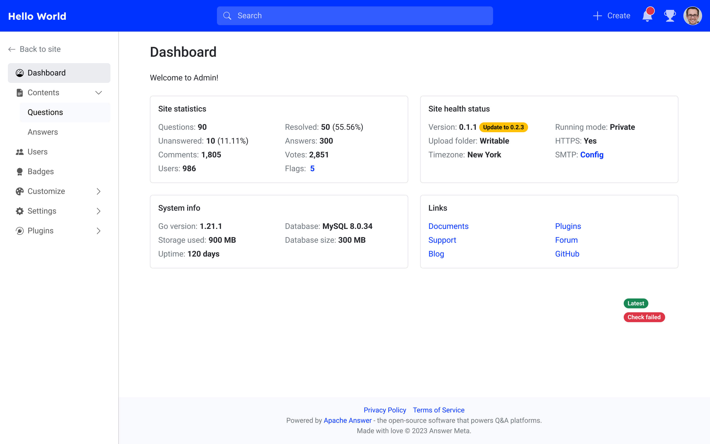
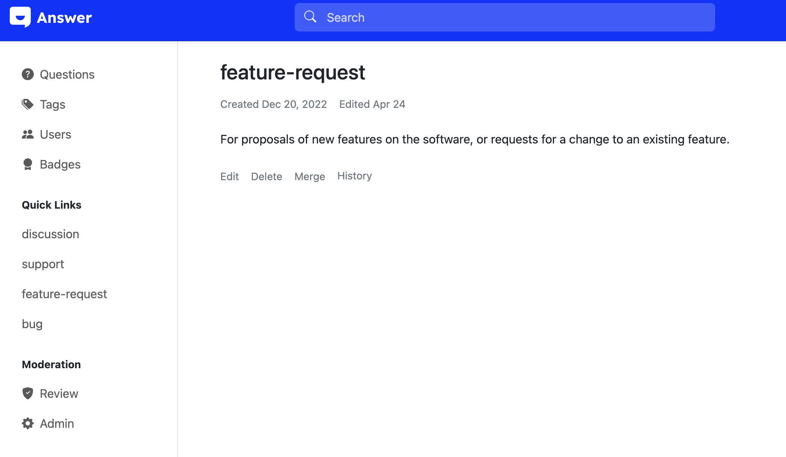
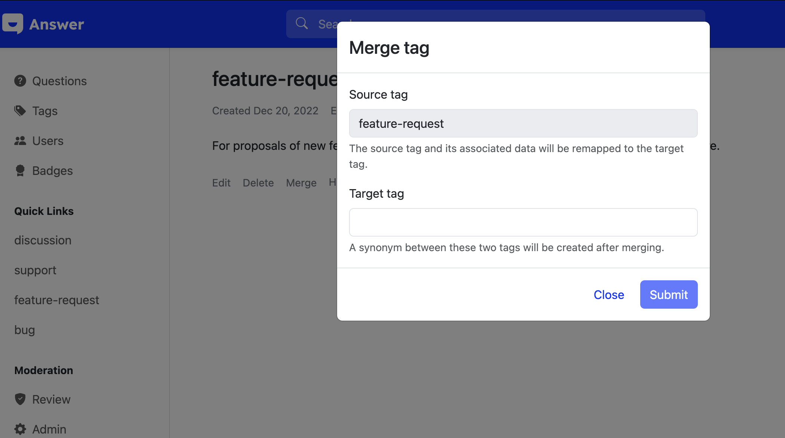

## 🎉 New Features

### Full-Width Layout with Sticky Left Menu

This update introduces a brand-new full-width layout. The left menu now supports sticky positioning, and the admin panel menu maintains consistency with the main site while adding icons to distinguish between different navigation levels, providing users with a smoother browsing experience.

### Tag Merge Feature

Added a tag merge feature for administrators and moderators. After merging, questions and followers associated with the source tag will be transferred to the new tag.

## 🔧 Improvements

- **Unified Admin Panel Left Menu Style**: The left menu in the admin panel now matches the site's style, improving visual consistency.
- **Optimized Mobile Search & Question Layout**: Enhanced the search and question page layouts on mobile devices for easier navigation.
- **Prevent Suspended Users from Logging In**: The system now blocks suspended users from logging in, improving security.
- **Auto-Set Server Time Zone as Default**: Automatically detects the server's location during installation and sets the default time zone, reducing manual configuration.
- **Search Plugin for Similar Questions on Ask Page**: Allows using a search plugin to quickly find similar questions when posting, avoiding duplicates.
- **Optimized Reaction Button Style in Dark Theme**:  Improved the visual design of reaction buttons in dark mode.

## 🐞 Bug Fixes
- **Username Minimum Length Set to 2**: Fixed a bug where the username minimum length was set to 2 but still prompted for a minimum of 4 characters.
- **Suspended Users Receiving Email Notifications**:  Resolved an issue where suspended users could still receive email notifications.
- **Duplicate Questions in Tag Search**: Fixed a bug where searching by tag could return duplicate questions.
- **answer build --output Relative Path Not Working**:  Corrected an issue where using relative paths for build output was ineffective.
- **Nil Pointer Error When Fetching Tags**:  Fixed a nil pointer error that could occur when retrieving tags under certain conditions.
- **Duplicate Security Requirements in Swagger Docs**: Removed redundant security requirement declarations in Swagger documentation.

## ❤️ Thanks You Contributions

A big thanks to all contributors who helped develop this release (sorted by GitHub ID):
[@hgaol](https://github.com/hgaol), [@LinkinStars](https://github.com/LinkinStars), [@seiyab](https://github.com/seiyab), [@shuashuai](https://github.com/shuashuai), [@sy-records](https://github.com/sy-records), [@xuthus5](https://github.com/xuthus5)

Your contributions made this release even better! 🚀
