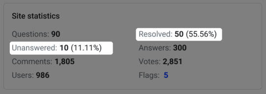

## 🎉 New Features
### Attachment Upload 

We’re excited to introduce the long-awaited attachment-upload feature! Now you can easily share relevant files with your questions.

You can config the `Authorized attachment extensions` in the Admin Panel to specify the file types you want to allow.

### Key Metrics Dashboard 

Get insights at a glance! Our new dashboard now includes key metrics(Resolved/Unanswered), helping you track your response rate.

### Add "Frequent" tab

Finding the most linked questions just got easier! With the new "Frequent" tab, you can filter and view the questions that are most often connected.

## 🔧 Improvements
- **Enhanced Readability:** Long code snippets can be challenging to read, but we’ve made improvements to ensure they’re more digestible. 
- **Reminder Email Update:** We’ve added a "Do not reply directly" message to our reminder emails to avoid confusion. Thanks, @sosyz, for the suggestion!
- **SEO Enhancements:** We’ve optimized the user homepage for better search engine visibility.

## 🐞 Bug Fixes
- **Markdown Parsing Fix:** We resolved an issue where ordered list numbers were not incrementing correctly during markdown parsing.
- **Tag Display Exception:** The change list/unlist action now works smoothly without causing tag display exceptions.
- **Timezone Display Issue:** The timezone display on the Dashboard page has been corrected, ensuring it shows properly when set to UTC.
- **Content Duplication Fix:** We’ve resolved the duplication of content on the results page.
- **User Addition Fix:** The unexpected username length restriction in the Admin Panel has been lifted, allowing for smoother user additions.

## ❤️ Special Thanks
We hope you enjoy the new features and improvements in Apache Answer 1.4.2! As always, we appreciate your feedback and contributions. Happy connecting!