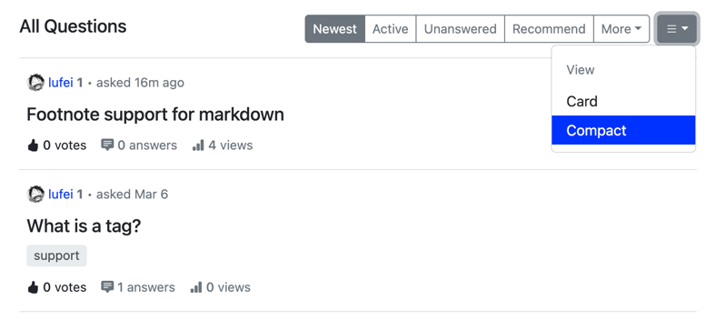

## 🎉 New Features

### Flexible Question Layouts

Add view layout options:

- **Card**: Show a summary of no more than 2 lines
  

- **Compact**: Show only the title

### Markdown, Elevated

- **Footnote Support**: Add references without cluttering your text.

- **One-Click Code Copy**: Simplify sharing with code block copy buttons.
- **Line Break Parsing Fix**: Comments with line breaks now render correctly.

### Security & Control

- **Permanent Delete**: Remove sensitive content irreversibly when needed.
- **External Image Toggle**: Disable external images to protect privacy or reduce clutter.
- **Automatic File Cleanup**: Unused files? The system now clears them automatically.

## 🔧 Improvements

- **PostgreSQL SSL Support**: Encrypt database connections for enhanced security.
- **Password Verification During Installation**: Added checks to prevent login lockouts from initial setup errors.
- **Legal Compliance**: Added "Privacy Policy" and "Terms of Service" links in the footer.
- **𝕏 Social Share Update**: The share dropdown now reflects Twitter’s rebranding to "X".

## 🐞 Bug Fixes

- **Image Uploads Restored**: Answer questions with images smoothly.
- **Plugin Build Timeouts**: Fixed `ERR_SOCKET_TIMEOUT` during local plugin development.
- **Translate Badges Fixed**: Multilingual tags now display correctly.
- **Admin Name Validation**: It now follows the same rules as the registration page.

## ⚙️ Under the Hood

- **Code Quality Boost**: Added linting steps for consistent UI code.
- **SEO Guard**: Blocked `/swagger/*` paths from search engines by default.

## ❤️ Thank You Contributors

Meet the new faces and greet the old acquaintances in this release today. Let's give a round of applause to:
[codewec](https://github.com/codewec), [LinkinStars](https://github.com/LinkinStars), [shuaishuai](https://github.com/shuashuai), [sy-records](https://github.com/sy-records), [miicchelle](https://github.com/miicchelle), [unical1988](https://github.com/unical1988), [CodexX777](https://github.com/CodexX777), and [Mindslayer001](https://github.com/Mindslayer001).

We hope you enjoy the new features and improvements in Apache Answer 1.4.5! As always, we appreciate your feedback and contributions. Happy connecting!
