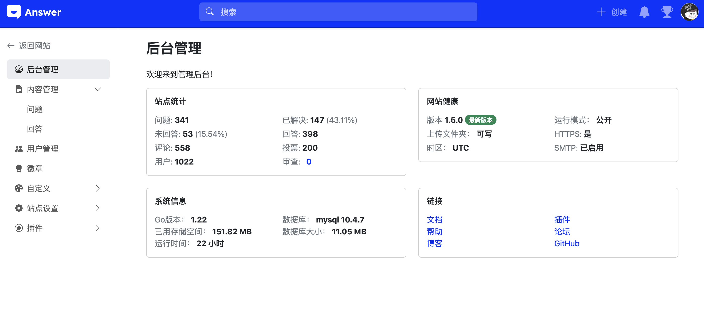

## 🎉 新功能

### 全宽布局与粘性左侧菜单

本次更新引入了全新的全宽布局，左侧菜单现在支持粘性定位，管理后台菜单保持跟主站一致同时添加了图标用于区分不同级别的导航，为用户提供更流畅的浏览体验。

### 标签合并功能

为管理员和版主添加了标签合并功能。标签合并后，源标签的问题和关注者也将在新标签下传输。

## 🔧 改进

- **管理员面板左侧菜单样式统一**：管理员面板的左侧菜单现在与站点风格保持一致，提升整体视觉一致性。
- **移动端搜索与提问布局优化**：改进了移动设备上的搜索和提问页面布局，使操作更加便捷。
- **禁止已封禁用户登录**：系统现在会阻止已被封禁的用户登录，增强安全性。
- **自动设置服务器所在时区为默认时区**：安装时自动检测服务器位置并设置默认时区，减少手动配置需求。
- **提问页面支持搜索插件查找相似问题**：在提问页面可使用搜索插件快速查找相似问题，避免重复提问。
- **暗黑主题下反应按钮样式优化**：优化了暗黑主题下的反应按钮样式，提升视觉效果。

## 🐞 Bug 修复
- **用户名最小长度为 2**： 修正了用户名最小长度为 2 但是校验仍然提示最小长度为 4 的 bug。
- **已封禁用户接收邮件通知**： 修复了已封禁用户仍能接收邮件通知的问题。
- **按标签搜索时问题重复**： 解决了按标签搜索时可能返回重复问题的 bug。
- **answer build --output 相对路径无效**： 修正了使用相对路径输出构建结果时无效的问题。
- **获取标签时页面空指针错误**： 修复了在某些情况下获取标签时可能出现的空指针错误。
- **Swagger 文档中重复的安全需求**： 移除了 Swagger 文档中重复的安全需求声明。

## ❤️ 感谢贡献

感谢所有参与本次版本开发的贡献者（按 GitHub ID 排序）：
[@hgaol](https://github.com/hgaol), [@LinkinStars](https://github.com/LinkinStars), [@seiyab](https://github.com/seiyab), [@shuashuai](https://github.com/shuashuai), [@sy-records](https://github.com/sy-records), [@xuthus5](https://github.com/xuthus5)

你们的贡献让这个版本更加完善！🚀